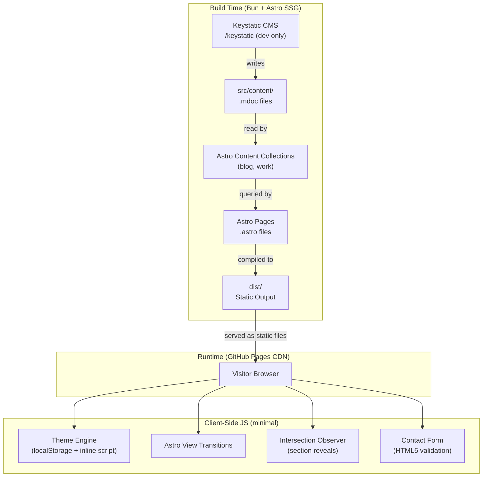

# Design Document: Alvin Penaflor Website

## Overview

A premium, dual-purpose static website for Alvin Penaflor, deployed to GitHub Pages. The site serves two distinct audiences simultaneously: potential web development clients (20+ years experience) and martial arts students/organizations (16 years Lapunti Arnis de Abanico). The design language is Monochromatic Editorial Minimalism — black/white only, ultra-bold sans-serif headers, tight tracking/leading, text-over-image masking, and section reveal animations.

The site is built with Astro v6 (SSG), Bun, Tailwind CSS v4, Keystatic CMS (local-only), and TypeScript strict mode. All pages are statically generated at build time; no server-side runtime is required.

### Key Design Decisions

- **Dual-path architecture**: Home page acts as a gateway routing visitors to either the Dev path (Work) or the Arnis path (Arnis), with distinct visual framing for each.
- **Keystatic local-only CMS**: Content lives as `.mdoc` files in `src/content/`, committed to git alongside code. No cloud dependency.
- **Theme engine with anti-FOUC**: Inline `<head>` script reads `localStorage` before first paint to prevent theme flicker.
- **Astro View Transitions**: Provides app-like navigation feel without a client-side router.
- **Tailwind v4 CSS-variable tokens**: All design tokens defined in `src/styles/global.css` `@theme` block; no `tailwind.config.js`.

---

## Architecture



### Directory Structure

```
src/
├── components/
│   ├── layout/          # BaseLayout, Header, Footer, Navigation
│   ├── home/            # Hero, DualPath, CorePhilosophy
│   ├── work/            # CaseStudyCard, CaseStudyDetail, ExperienceTable
│   ├── arnis/           # ArnisHero, InstructorBio, SeminarCTA
│   ├── blog/            # BlogFeed, BlogCard, CategoryFilter
│   ├── contact/         # ContactForm
│   └── ui/              # Button, AnimatedSection, ThemeToggle
├── content/
│   ├── blog/            # .mdoc files (blog posts)
│   └── work/            # .mdoc files (case studies)
├── layouts/
│   └── BaseLayout.astro
├── pages/
│   ├── index.astro      # Home (/)
│   ├── work/
│   │   ├── index.astro  # Work listing (/work)
│   │   └── [slug].astro # Case study detail (/work/[slug])
│   ├── arnis.astro      # Arnis (/arnis)
│   ├── blog/
│   │   ├── index.astro  # Blog listing (/blog)
│   │   └── [slug].astro # Blog post detail (/blog/[slug])
│   └── contact.astro    # Contact (/contact)
├── styles/
│   └── global.css       # @theme tokens, base styles
└── keystatic.config.ts  # Keystatic CMS configuration
```

---

## Components and Interfaces

### BaseLayout

Wraps every page. Injects the anti-FOUC inline script, global CSS, font preloads, and Astro's `<ViewTransitions />` component.

```typescript
interface BaseLayoutProps {
  title: string;
  description?: string;
  ogImage?: string;
}
```

### Header / Navigation

Persistent across all pages. Contains nav links (Home, Work, Arnis, Blog, Contact), the ThemeToggle, and active-link highlighting via `Astro.url.pathname`.

### ThemeToggle

Client-side island (`client:load`). Reads/writes `localStorage` key `theme`. Emits a class change on `<html>`.

```typescript
// Theme values
type Theme = 'light' | 'dark';
```

### AnimatedSection

Wrapper component using `IntersectionObserver` to trigger reveal animations when sections enter the viewport. Respects `prefers-reduced-motion`.

```typescript
interface AnimatedSectionProps {
  animation?: 'fade-up' | 'fade-in' | 'slide-left';
  delay?: number; // ms
}
```

### BlogFeed

Renders a list of `BlogCard` components. Accepts a `category` filter prop for client-side filtering.

```typescript
interface BlogFeedProps {
  posts: BlogPost[];
  initialCategory?: 'all' | 'tech' | 'martial-arts';
}
```

### ContactForm

Pure HTML5 form with client-side validation. No server-side processing — uses `mailto:` or a static form service. Validates required fields and email format inline.

```typescript
interface ContactFormFields {
  name: string;
  email: string;
  inquiryType: 'web-development' | 'arnis-martial-arts';
  message: string;
}
```

---

## Data Models

### Blog Post (Content Collection)

Defined in `src/content/config.ts` using Astro's `defineCollection` and `z` (Zod schema).

```typescript
// src/content/config.ts
const blogCollection = defineCollection({
  type: 'content',
  schema: z.object({
    title: z.string(),
    publishDate: z.date(),
    category: z.enum(['tech', 'martial-arts']),
    excerpt: z.string().optional(),
    draft: z.boolean().default(false),
  }),
});
```

File location: `src/content/blog/*.mdoc`

### Case Study (Content Collection)

```typescript
const workCollection = defineCollection({
  type: 'content',
  schema: z.object({
    title: z.string(),
    projectContext: z.string(),
    problem: z.string(),
    solution: z.string(),
    outcome: z.string(),
    technologies: z.array(z.string()),
    isPublic: z.boolean().default(true),
    order: z.number().optional(), // display order
  }),
});
```

File location: `src/content/work/*.mdoc`

### Keystatic CMS Configuration

```typescript
// keystatic.config.ts
export default config({
  storage: { kind: 'local' },
  collections: {
    blog: collection({
      label: 'Blog Posts',
      slugField: 'title',
      path: 'src/content/blog/*',
      format: { contentField: 'content' },
      schema: {
        title: fields.slug({ name: { label: 'Title' } }),
        publishDate: fields.date({ label: 'Publish Date' }),
        category: fields.select({
          label: 'Category',
          options: [
            { label: 'Tech', value: 'tech' },
            { label: 'Martial Arts', value: 'martial-arts' },
          ],
          defaultValue: 'tech',
        }),
        excerpt: fields.text({ label: 'Excerpt', multiline: true }),
        draft: fields.checkbox({ label: 'Draft', defaultValue: false }),
        content: fields.markdoc({ label: 'Content' }),
      },
    }),
    work: collection({
      label: 'Case Studies',
      slugField: 'title',
      path: 'src/content/work/*',
      format: { contentField: 'content' },
      schema: {
        title: fields.slug({ name: { label: 'Title' } }),
        projectContext: fields.text({ label: 'Project Context', multiline: true }),
        problem: fields.text({ label: 'Problem Statement', multiline: true }),
        solution: fields.text({ label: 'Solution', multiline: true }),
        outcome: fields.text({ label: 'Outcome', multiline: true }),
        technologies: fields.array(fields.text({ label: 'Technology' }), {
          label: 'Technologies',
          itemLabel: (props) => props.fields.value.value,
        }),
        isPublic: fields.checkbox({ label: 'Public', defaultValue: true }),
        order: fields.integer({ label: 'Display Order' }),
        content: fields.markdoc({ label: 'Full Content' }),
      },
    }),
  },
});
```

### Design Tokens (CSS Variables)

All tokens live in `src/styles/global.css` inside `@theme {}`:

```css
@theme {
  /* Colors — monochromatic only */
  --color-ink: #000000;
  --color-paper: #ffffff;
  --color-ink-muted: #1a1a1a;
  --color-paper-muted: #f5f5f5;

  /* Typography */
  --font-display: 'Inter', sans-serif;
  --font-body: 'Inter', sans-serif;
  --font-weight-black: 900;
  --font-weight-bold: 700;

  /* Spacing scale */
  --spacing-section: 6rem;

  /* Animation */
  --duration-reveal: 600ms;
  --easing-reveal: cubic-bezier(0.16, 1, 0.3, 1);
}
```

---

## Correctness Properties

*A property is a characteristic or behavior that should hold true across all valid executions of a system — essentially, a formal statement about what the system should do. Properties serve as the bridge between human-readable specifications and machine-verifiable correctness guarantees.*

### Property 1: Theme toggle persistence round-trip

*For any* initial theme state (`light` or `dark`), when the ThemeToggle is activated, the active theme class on `<html>` should flip to the opposite value AND `localStorage` should be updated to reflect that new value.

**Validates: Requirements 2.2, 2.5**

---

### Property 2: Active navigation link correctness

*For any* page URL in the site (/, /work, /arnis, /blog, /contact), the navigation link whose `href` matches that URL should carry the active/current indicator class, and no other nav link should carry that class simultaneously.

**Validates: Requirements 3.5**

---

### Property 3: Work page shows all public case studies

*For any* set of case study entries in the content collection where `isPublic` is `true`, the Work page should render a card or entry for every one of them — and the total count should be at least 3.

**Validates: Requirements 5.1**

---

### Property 4: Case study detail round-trip

*For any* case study entry in the content collection, navigating to `/work/[slug]` should render a page whose content includes the case study's title, problem statement, solution, and outcome fields.

**Validates: Requirements 5.3**

---

### Property 5: Blog feed sort order

*For any* set of blog post entries in the content collection, the rendered blog feed should display posts in descending order by `publishDate` — i.e., for any two adjacent posts in the rendered list, the earlier post's `publishDate` should be greater than or equal to the later post's `publishDate`.

**Validates: Requirements 7.1**

---

### Property 6: Blog category filter correctness

*For any* category value (`tech` or `martial-arts`) applied as a filter, every blog post displayed in the feed should have a `category` field equal to the selected filter value — no posts from other categories should appear.

**Validates: Requirements 7.2, 7.3**

---

### Property 7: Blog post detail round-trip

*For any* blog post entry in the content collection, navigating to `/blog/[slug]` should render a page that contains the post's title, `publishDate`, `category`, and full body content.

**Validates: Requirements 7.5, 7.6**

---

### Property 8: Contact form required-field validation

*For any* required field in the Contact_Form (name, email, inquiryType, message) left empty at submission, the form should not submit and should display an inline validation message identifying that specific field as required.

**Validates: Requirements 8.4**

---

### Property 9: Contact form email format validation

*For any* string that does not conform to a valid email address format (e.g., missing `@`, missing domain), submitting the Contact_Form with that value in the email field should be rejected with an inline validation message.

**Validates: Requirements 8.5**

---

## Error Handling

### Build-Time Errors

- **Missing content fields**: Astro's Zod schema validation on content collections will throw a descriptive build error if a `.mdoc` file is missing a required field (e.g., `publishDate`, `title`). The build halts with the file path and field name.
- **Invalid content types**: Zod type mismatches (e.g., a string where a date is expected) surface as build errors with the collection name and slug.
- **Broken image references**: Astro's image optimization pipeline will error at build time if a referenced image file does not exist.

### Runtime / Client-Side Errors

- **Theme initialization failure**: If `localStorage` is unavailable (e.g., private browsing restrictions), the theme engine falls back to `prefers-color-scheme` without throwing. The toggle still functions for the session.
- **Contact form validation**: All validation is client-side HTML5 + JS. Invalid submissions are blocked before any network request. Error messages are displayed inline adjacent to the offending field.
- **Missing slug**: If a visitor navigates to `/work/nonexistent` or `/blog/nonexistent`, Astro's static generation will not produce that page, resulting in a GitHub Pages 404. A custom `404.astro` page should be provided.

### Content Errors

- **Empty collections**: If the blog or work collection has zero entries, the listing pages should render gracefully with an empty state message rather than crashing.
- **Draft posts**: Blog posts with `draft: true` are excluded from the collection query at build time and never appear in the feed or generate detail pages.

---

## Testing Strategy

### Dual Testing Approach

Both unit tests and property-based tests are required. They are complementary:
- Unit tests catch concrete bugs in specific scenarios and verify integration points.
- Property-based tests verify universal correctness across a wide range of generated inputs.

### Unit Tests

Focus on:
- Specific examples: header contains all 5 nav links, Contact page has LinkedIn/GitHub links, Arnis page has bio section, etc.
- Integration points: content collection queries return correctly shaped data, Keystatic config defines required collections and fields.
- Edge cases: empty blog collection renders gracefully, draft posts are excluded, theme defaults to OS preference when localStorage is empty.

Suggested framework: **Vitest** (native ESM, fast, integrates well with Astro/Bun).

Example unit test targets:
- `Header` renders links to `/`, `/work`, `/arnis`, `/blog`, `/contact`
- `Home` page contains Hero, DualPath block (links to `/work` and `/arnis`), and Core Philosophy section
- `Work` page contains a CTA link to `/contact`
- `Arnis` page contains philosophy section, bio section, and CTA link to `/contact`
- `Contact` page form has `name`, `email`, `inquiryType`, `message` fields and both inquiry type options
- `Contact` page has LinkedIn and GitHub links
- Keystatic config has `blog` and `work` collections with all required fields
- Keystatic config has `storage.kind === 'local'`
- `global.css` contains `@theme` block with expected token names

### Property-Based Tests

Suggested library: **fast-check** (TypeScript-native, works with Vitest).

Each property test must run a minimum of **100 iterations**.

Each test must be tagged with a comment in this format:
`// Feature: alvin-penaflor-website, Property {N}: {property_text}`

| Property | Test Description | fast-check Approach |
|---|---|---|
| Property 1: Theme toggle persistence | Generate arbitrary initial theme; simulate toggle; assert html class and localStorage both reflect new theme | `fc.constantFrom('light', 'dark')` |
| Property 2: Active nav link correctness | Generate any of the 5 page paths; render nav; assert exactly one active link matches path | `fc.constantFrom('/', '/work', '/arnis', '/blog', '/contact')` |
| Property 3: Work page shows all public case studies | Generate N public case studies (N >= 3); render Work page; assert all N appear | `fc.array(arbitraryCaseStudy(), { minLength: 3 })` |
| Property 4: Case study detail round-trip | Generate arbitrary case study; render `/work/[slug]`; assert all fields present in output | `fc.record({ title, problem, solution, outcome, ... })` |
| Property 5: Blog feed sort order | Generate arbitrary array of blog posts; render feed; assert descending publishDate order | `fc.array(arbitraryBlogPost(), { minLength: 2 })` |
| Property 6: Blog category filter | Generate arbitrary posts and a category; apply filter; assert all results match category | `fc.tuple(fc.array(arbitraryBlogPost()), fc.constantFrom('tech', 'martial-arts'))` |
| Property 7: Blog post detail round-trip | Generate arbitrary blog post; render `/blog/[slug]`; assert title, date, category, body present | `fc.record({ title, publishDate, category, body })` |
| Property 8: Required field validation | Generate form submissions with one required field empty; assert form blocked + error shown | `fc.constantFrom('name', 'email', 'inquiryType', 'message')` |
| Property 9: Email format validation | Generate invalid email strings; submit form; assert validation error shown | `fc.string()` filtered to exclude valid email patterns |

### Accessibility

- All interactive elements must have accessible labels (aria-label or visible text).
- Color contrast must meet WCAG AA minimums (verified manually or with axe-core in CI).
- `prefers-reduced-motion` media query must be present in animation CSS (verified by unit test checking the stylesheet).
