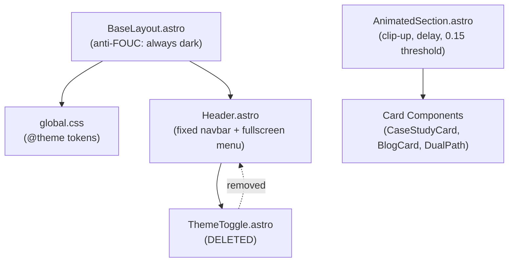
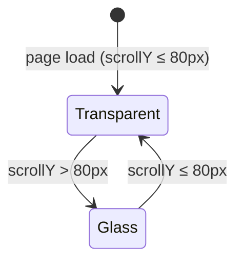

# Design Document: UI/UX Improvements

## Overview

This document describes the technical design for overhauling the visual design and interactivity of Alvin Penaflor's personal website. The site pivots from a black/white monochromatic scheme to a **dark glassmorphism** aesthetic: a permanently dark `#0A0A0A` canvas with frosted-glass UI surfaces, gray midtone tokens for typographic hierarchy, and fluid spring-curve motion design.

The six areas of change are:

1. Design system token overhaul (`global.css @theme`)
2. Contrast compliance across all text elements
3. Animation and micro-interaction refinement (`AnimatedSection`, card hover states)
4. Navbar visual refinement (fixed, transparent → glass on scroll)
5. Fullscreen mobile navigation overlay
6. Navbar scroll effect

Light/dark mode toggling is removed entirely. The `ThemeToggle` component is deleted. The site is permanently dark.

---

## Architecture

The implementation is purely presentational — no new data fetching, routing, or server-side logic is introduced. All changes are confined to:

- `src/styles/global.css` — design token definitions and base styles
- `src/layouts/BaseLayout.astro` — anti-FOUC script simplification
- `src/components/layout/Navbar.astro` — navbar + fullscreen mobile menu (replaces current slide-down panel)
- `src/components/ui/AnimatedSection.astro` — enhanced variants, `clip-up`, `delay` prop, 15% threshold
- `src/components/ui/ThemeToggle.astro` — **deleted**
- `src/components/work/CaseStudyCard.astro` — glass micro-interactions
- `src/components/blog/BlogCard.astro` — glass micro-interactions
- `src/components/home/DualPath.astro` — glass micro-interactions



### Key Architectural Decisions

**No new component files for scroll effect or mobile menu** — both are implemented as inline `<script>` blocks within `Header.astro`, consistent with the existing pattern. This avoids introducing a client-side framework dependency for what is fundamentally a DOM state toggle.

**CSS-first animations** — all transitions are defined in `<style>` blocks using CSS custom properties and class toggles. JavaScript only adds/removes classes; it never sets `style` properties for animation values (except for staggered delay offsets on mobile menu links, which are data-driven).

**Tailwind v4 `@theme` as single source of truth** — all new design tokens are defined once in `global.css` under `@theme`. Components reference tokens via CSS custom properties (`var(--color-surface)`), not hardcoded values.

---

## Components and Interfaces

### 1. `global.css` — Design Token Overhaul

The `@theme` block is replaced entirely. The `html.dark` override block is removed. The `body` base style is updated to use the new canvas token.

**Token additions/changes:**

| Token                    | Value                        | Usage                                |
| ------------------------ | ---------------------------- | ------------------------------------ |
| `--color-canvas`         | `#0A0A0A`                    | Page background                      |
| `--color-surface`        | `rgba(255,255,255,0.06)`     | Glass card/panel background          |
| `--color-surface-hover`  | `rgba(255,255,255,0.10)`     | Glass card hover state               |
| `--color-surface-border` | `rgba(255,255,255,0.12)`     | Glass edge/border                    |
| `--color-ink`            | `#FFFFFF`                    | Primary text                         |
| `--color-ink-muted`      | `#A1A1AA`                    | Secondary text (zinc-400)            |
| `--color-ink-subtle`     | `#71717A`                    | Tertiary/label text (zinc-500)       |
| `--color-accent`         | `#E4E4E7`                    | Active states, highlights (zinc-200) |
| `--blur-glass`           | `16px`                       | Standard backdrop blur               |
| `--blur-glass-heavy`     | `24px`                       | Heavy backdrop blur (mobile menu)    |
| `--duration-reveal`      | `700ms`                      | Section reveal duration              |
| `--easing-reveal`        | `cubic-bezier(0.16,1,0.3,1)` | Spring-curve easing                  |

**Removed tokens:** `--color-ink-muted: #1a1a1a`, `--color-paper`, `--color-paper-muted`

**Removed blocks:** `html.dark body { ... }` override

### 2. `BaseLayout.astro` — Anti-FOUC Simplification

The inline `<script is:inline>` that reads `localStorage` and checks `prefers-color-scheme` is replaced with a single unconditional class application:

```html
<script is:inline>
  document.documentElement.classList.add('dark');
</script>
```

The `<html>` element always has `class="dark"` before first paint. No `localStorage` reads, no media query checks.

### 3. `Header.astro` — Navbar + Fullscreen Mobile Menu

The current `Header.astro` is substantially rewritten. Key structural changes:

- `ThemeToggle` import and usage removed
- Navbar height changed from `h-14` to `h-16`
- Wordmark updated to `text-base font-black tracking-[-0.04em]`
- Desktop nav links updated to `text-xs font-bold tracking-[0.12em] uppercase` with `--color-ink-muted` default color
- Active link indicator uses `--color-accent` via `::after` pseudo-element
- Navbar starts `bg-transparent` with no border; scroll effect adds glass state via `.is-scrolled` class
- Spacer `div` updated from `h-14` to `h-16`
- Mobile menu replaced with fullscreen overlay (see below)

**Navbar scroll state machine:**



**CSS for scroll states:**

```css
/* Default: transparent */
header {
  background: transparent;
  border-bottom: none;
  transition:
    background 250ms ease-out,
    border-color 250ms ease-out;
}

/* Scrolled: glass */
header.is-scrolled {
  background: rgba(10, 10, 10, 0.8);
  backdrop-filter: blur(var(--blur-glass));
  border-bottom: 1px solid var(--color-surface-border);
}
```

**Scroll effect script** (passive listener, re-initialized on `astro:after-swap`):

```js
function initScrollEffect() {
  const header = document.querySelector('header');
  const THRESHOLD = 80;
  const reduced = window.matchMedia('(prefers-reduced-motion: reduce)').matches;

  function update() {
    const scrolled = window.scrollY > THRESHOLD;
    header.classList.toggle('is-scrolled', scrolled);
    if (reduced) header.style.transition = 'none';
  }

  window.addEventListener('scroll', update, { passive: true });
  update(); // apply on load
}
initScrollEffect();
document.addEventListener('astro:after-swap', initScrollEffect);
```

### 4. Fullscreen Mobile Menu Overlay

The current slide-down `<nav id="mobile-menu">` inside `<header>` is replaced with a sibling `<div id="mobile-menu">` rendered at the `<body>` level (or as a direct child of `<header>` with `position: fixed; inset: 0; z-index: 40`).

**Structure:**

```html
<div
  id="mobile-menu"
  role="dialog"
  aria-modal="true"
  aria-label="Navigation menu"
  class="mobile-menu fixed inset-0 z-40 flex flex-col items-center justify-center
         opacity-0 pointer-events-none"
  style="background: rgba(10,10,10,0.95); backdrop-filter: blur(var(--blur-glass-heavy));"
>
  <nav aria-label="Mobile navigation">
    <ul class="flex flex-col items-center gap-8">
      <!-- links with staggered --link-delay CSS custom property -->
    </ul>
  </nav>
  <!-- Close button (×) for accessibility -->
</div>
```

**Open/close animation:**

```css
.mobile-menu {
  transition:
    opacity 350ms cubic-bezier(0.16, 1, 0.3, 1),
    transform 350ms cubic-bezier(0.16, 1, 0.3, 1);
  transform: translateY(-8px);
}
.mobile-menu.is-open {
  opacity: 1;
  pointer-events: auto;
  transform: translateY(0);
}
/* Close: override transition for faster exit */
.mobile-menu.is-closing {
  transition:
    opacity 250ms ease-in,
    transform 250ms ease-in;
  opacity: 0;
  transform: translateY(-8px);
}
```

**Staggered link entrance** — each `<li>` receives `style="--link-delay: {index * 50}ms"` rendered server-side in Astro. The CSS applies `transition-delay: var(--link-delay)` on opacity/transform for the links.

**Focus trap** — implemented in the `<script>` block using `querySelectorAll` for focusable elements within `#mobile-menu`, with `keydown` listener intercepting `Tab`/`Shift+Tab` to cycle within the menu and `Escape` to close.

**`body` scroll lock** — `document.body.style.overflow = 'hidden'` on open, restored on close.

**Hamburger → × animation:**

```css
.hamburger-bar {
  transition:
    transform 250ms ease-in-out,
    opacity 250ms ease-in-out;
}
[aria-expanded='true'] .bar-top {
  transform: translateY(7px) rotate(45deg);
}
[aria-expanded='true'] .bar-mid {
  opacity: 0;
}
[aria-expanded='true'] .bar-bottom {
  transform: translateY(-7px) rotate(-45deg);
}
```

### 5. `AnimatedSection.astro` — Enhanced Variants

**New `clip-up` variant:**

```css
.animated-section[data-animation='clip-up'] {
  clip-path: inset(100% 0 0 0);
  opacity: 1; /* clip-up uses clip-path, not opacity */
}
.animated-section[data-animation='clip-up'].is-visible {
  clip-path: inset(0% 0 0 0);
}
```

**`will-change` lifecycle:**

```css
.animated-section:not(.is-visible) {
  will-change: transform;
}
.animated-section.is-visible {
  will-change: auto;
}
```

**Threshold change:** `{ threshold: 0.1 }` → `{ threshold: 0.15 }`

**Duration:** All variants use `700ms` with `cubic-bezier(0.16, 1, 0.3, 1)` (already defined as `--easing-reveal`).

**Props interface:**

```typescript
interface Props {
  animation?: 'fade-up' | 'fade-in' | 'slide-left' | 'clip-up';
  delay?: number; // ms, default 0
  class?: string;
}
```

### 6. Card Glass Micro-Interactions

All three card components (`CaseStudyCard`, `BlogCard`, `DualPath` path blocks) receive the same hover treatment, replacing the current `hover:bg-[var(--color-ink)]` inversion pattern.

**Before (current):**

```html
class="border border-[var(--color-ink)] hover:bg-[var(--color-ink)]
hover:text-[var(--color-paper)] transition-colors duration-200"
```

**After (glass):**

```html
class="glass-card border border-[var(--color-surface-border)]
bg-[var(--color-surface)] transition-[background-color,transform,border-color]
duration-200 ease-out hover:bg-[var(--color-surface-hover)]
hover:-translate-y-0.5 hover:border-white/24"
```

The `opacity-60` / `opacity-40` patterns on text within cards are replaced with `text-[var(--color-ink-muted)]` and `text-[var(--color-ink-subtle)]` respectively.

**CTA arrow micro-interaction** — the `→` arrow in "Read More →" and "View Work →" links is wrapped in a `<span>` with:

```css
.cta-arrow {
  display: inline-block;
  transition: transform 150ms ease-out;
}
.cta-link:hover .cta-arrow {
  transform: translateX(4px);
}
```

---

## Data Models

No new data models are introduced. This feature is purely presentational. The only "data" involved is:

- **Design tokens** — CSS custom properties in `@theme` (static, compile-time)
- **Nav links array** — already defined in `Header.astro` as a static TypeScript array; no changes to shape
- **Animation config** — `animation` variant string + `delay` number, passed as Astro props to `AnimatedSection`

---

## Correctness Properties

_A property is a characteristic or behavior that should hold true across all valid executions of a system — essentially, a formal statement about what the system should do. Properties serve as the bridge between human-readable specifications and machine-verifiable correctness guarantees._

### Property 1: Text contrast meets WCAG AA minimums

_For any_ text element on the site, if it uses `--color-ink` (`#FFFFFF`) the contrast ratio against `--color-canvas` (`#0A0A0A`) shall be ≥ 4.5:1 for body text and ≥ 3:1 for large text; if it uses `--color-ink-muted` (`#A1A1AA`) the contrast ratio shall be ≥ 4.5:1; if it uses `--color-ink-subtle` (`#71717A`) the contrast ratio shall be ≥ 4.5:1.

**Validates: Requirements 1.1, 1.2, 1.6**

### Property 2: No low-opacity text on meaningful content

_For any_ text element that conveys meaningful content, the computed opacity shall be ≥ 0.5. Equivalently, no Tailwind opacity utility class below `opacity-50` shall appear on a text-bearing element.

**Validates: Requirements 1.3**

### Property 3: AnimatedSection renders correct attributes for all valid configs

_For any_ combination of valid `animation` variant (`fade-up`, `fade-in`, `slide-left`, `clip-up`) and `delay` value (non-negative integer), the rendered `AnimatedSection` element shall have `data-animation` set to the variant and `--reveal-delay` CSS custom property set to `{delay}ms`.

**Validates: Requirements 2.1, 2.2**

### Property 4: Only transform and opacity are animated

_For any_ animated element in the site, the CSS `transition` and `animation` declarations shall reference only `transform`, `opacity`, `clip-path`, `background-color`, or `border-color` properties — never `width`, `height`, `top`, `left`, `margin`, `padding`, or other layout-triggering properties.

**Validates: Requirements 2.4**

### Property 5: will-change lifecycle is correct

_For any_ `.animated-section` element, `will-change: transform` shall be set before the `is-visible` class is applied, and `will-change: auto` shall be set after `is-visible` is applied.

**Validates: Requirements 2.6**

### Property 6: Active nav link indicator present for every route

_For any_ page route in the site's nav links array, when that route is the current pathname, the corresponding nav link element shall have the active indicator class applied (resulting in a `::after` pseudo-element with `--color-accent` border).

**Validates: Requirements 3.4**

### Property 7: Mobile menu nav links have correct staggered delays

_For any_ list of nav links rendered in the mobile menu, each link at index `i` shall have a `--link-delay` CSS custom property equal to `i * 50ms`, ensuring staggered entrance animation.

**Validates: Requirements 4.7**

### Property 8: aria-expanded reflects mobile menu open/closed state

_For any_ open/closed state transition of the mobile menu, the hamburger button's `aria-expanded` attribute shall equal `"true"` when the menu is open and `"false"` when the menu is closed — with no state where the attribute value does not match the visual state.

**Validates: Requirements 4.10**

### Property 9: Focus trap contains all keyboard focus within open mobile menu

_For any_ focusable element outside the mobile menu, when the mobile menu is open, that element shall not receive focus via keyboard Tab navigation. Focus shall cycle only among focusable elements within `#mobile-menu`.

**Validates: Requirements 4.12**

### Property 10: Navbar scroll state is a round-trip

_For any_ scroll position sequence where the user scrolls past 80px and then back to ≤ 80px, the navbar shall return to exactly the transparent state (no glass background, no bottom border) — identical to its initial state on page load.

**Validates: Requirements 5.4**

---

## Error Handling

### Scroll Effect — No Header Element

If `document.querySelector('header')` returns `null` (e.g., during a View Transitions swap), the scroll handler exits early without throwing. The `initScrollEffect` function guards with a null check before attaching the listener.

### Mobile Menu — Missing DOM Elements

The `initMenu` function checks for the existence of `#menu-toggle` and `#mobile-menu` before attaching event listeners. If either is absent (e.g., on a page that doesn't render the Header), the function returns early.

### Focus Trap — No Focusable Elements

If `querySelectorAll` for focusable elements within the mobile menu returns an empty list, the `keydown` Tab handler is a no-op (no focus cycling attempted).

### AnimatedSection — IntersectionObserver Unavailability

If `IntersectionObserver` is not available (very old browsers), the `initAnimatedSections` function falls back to immediately adding `is-visible` to all `.animated-section` elements, ensuring content is always visible.

### Reduced Motion

All animation and transition logic checks `window.matchMedia('(prefers-reduced-motion: reduce)').matches` before applying motion. When active:

- `AnimatedSection` immediately applies `is-visible` to all sections
- Scroll effect applies the scrolled state class without CSS transition (sets `transition: none` inline)
- Mobile menu open/close skips transition classes

### View Transitions Re-initialization

All `<script>` blocks that attach DOM event listeners use the `astro:after-swap` event to re-initialize after View Transitions navigation. This prevents stale listeners from accumulating across navigations.

---

## Testing Strategy

### Dual Testing Approach

Both unit tests and property-based tests are required. Unit tests verify specific examples and edge cases; property-based tests verify universal behaviors across generated inputs. Together they provide comprehensive coverage.

### Unit Tests (Specific Examples and Edge Cases)

Unit tests focus on:

- Verifying design tokens are defined with correct values in `global.css`
- Verifying `ThemeToggle` is not imported or rendered in `Header.astro`
- Verifying the anti-FOUC script in `BaseLayout.astro` unconditionally adds `class="dark"`
- Verifying the `html.dark` override block is absent from `global.css`
- Verifying the navbar has `position: fixed` CSS
- Verifying the mobile menu has `position: fixed; inset: 0` CSS
- Verifying the mobile menu is hidden by default (`opacity-0`, `pointer-events-none`)
- Verifying `aria-expanded="false"` is the default state on the hamburger button
- Verifying `body` receives `overflow: hidden` when mobile menu opens
- Verifying the scroll effect applies `.is-scrolled` class at the 80px threshold
- Verifying `prefers-reduced-motion` disables transitions on `AnimatedSection`
- Verifying `prefers-reduced-motion` applies scroll state without transition
- Verifying the `--color-ink-subtle` (#71717A) contrast ratio against `--color-canvas` (#0A0A0A) is ≥ 4.5:1
- Verifying `--color-surface-border` (rgba(255,255,255,0.12)) is visible against `--color-canvas`
- Verifying the `clip-up` variant uses `clip-path` from `inset(100% 0 0 0)` to `inset(0% 0 0 0)`
- Verifying the intersection threshold is `0.15`

### Property-Based Tests

Property-based testing library: **fast-check** (TypeScript-native, works in Vitest/Jest environments).

Each property test runs a minimum of **100 iterations**.

Each test is tagged with a comment in the format:
`// Feature: ui-ux-improvements, Property {N}: {property_text}`

**Property 1 — Text contrast meets WCAG AA minimums**
Generate random combinations of the defined ink tokens and verify the contrast ratio formula `(L1 + 0.05) / (L2 + 0.05)` meets the required threshold for each token/usage pairing.

```
// Feature: ui-ux-improvements, Property 1: Text contrast meets WCAG AA minimums
fc.assert(fc.property(fc.constantFrom('--color-ink', '--color-ink-muted', '--color-ink-subtle'), (token) => {
  const ratio = computeContrastRatio(TOKEN_VALUES[token], '#0A0A0A');
  return ratio >= 4.5;
}));
```

**Property 2 — No low-opacity text**
Generate random Tailwind opacity class names and verify that any class below `opacity-50` does not appear on text-bearing elements in the rendered HTML.

```
// Feature: ui-ux-improvements, Property 2: No low-opacity text on meaningful content
```

**Property 3 — AnimatedSection renders correct attributes**
Generate random valid animation variants and delay values; render the component and assert `data-animation` and `--reveal-delay` match inputs.

```
// Feature: ui-ux-improvements, Property 3: AnimatedSection renders correct attributes for all valid configs
fc.assert(fc.property(
  fc.constantFrom('fade-up', 'fade-in', 'slide-left', 'clip-up'),
  fc.nat(2000),
  (variant, delay) => { /* render + assert */ }
));
```

**Property 4 — Only transform/opacity animated**
Parse all CSS transition and animation declarations in the component stylesheets; for any animated property, assert it is in the allowed set.

```
// Feature: ui-ux-improvements, Property 4: Only transform and opacity are animated
```

**Property 5 — will-change lifecycle**
For any `.animated-section` element, assert `will-change: transform` before `is-visible` and `will-change: auto` after.

```
// Feature: ui-ux-improvements, Property 5: will-change lifecycle is correct
```

**Property 6 — Active nav link for every route**
Generate random route strings from the nav links array; render the Header with that route as `pathname`; assert the corresponding link has the active class.

```
// Feature: ui-ux-improvements, Property 6: Active nav link indicator present for every route
fc.assert(fc.property(fc.constantFrom('/', '/work', '/arnis', '/blog', '/contact'), (route) => {
  /* render Header with pathname=route, assert active class */
}));
```

**Property 7 — Staggered mobile menu delays**
Generate random nav link arrays of varying lengths; render the mobile menu; assert each link at index `i` has `--link-delay: {i * 50}ms`.

```
// Feature: ui-ux-improvements, Property 7: Mobile menu nav links have correct staggered delays
fc.assert(fc.property(fc.array(fc.string(), { minLength: 1, maxLength: 10 }), (links) => {
  /* render + assert delay per index */
}));
```

**Property 8 — aria-expanded reflects state**
Generate random sequences of open/close toggle operations; after each operation, assert `aria-expanded` matches the expected boolean state.

```
// Feature: ui-ux-improvements, Property 8: aria-expanded reflects mobile menu open/closed state
fc.assert(fc.property(fc.array(fc.boolean(), { minLength: 1, maxLength: 20 }), (toggles) => {
  /* simulate toggles, assert aria-expanded matches state */
}));
```

**Property 9 — Focus trap**
Generate random sets of focusable elements inside and outside the mobile menu; when menu is open, assert Tab navigation never reaches outside elements.

```
// Feature: ui-ux-improvements, Property 9: Focus trap contains all keyboard focus within open mobile menu
```

**Property 10 — Navbar scroll round-trip**
Generate random scroll position sequences that cross the 80px threshold in both directions; assert the final navbar state matches the expected state for the final scroll position.

```
// Feature: ui-ux-improvements, Property 10: Navbar scroll state is a round-trip
fc.assert(fc.property(fc.array(fc.nat(500), { minLength: 2, maxLength: 50 }), (positions) => {
  /* simulate scroll positions, assert final state */
}));
```
